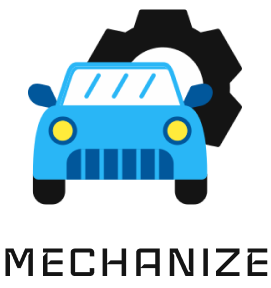
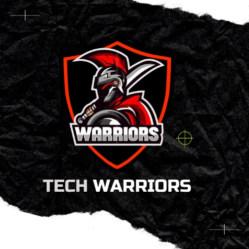

<a href="https://play.google.com/store/apps/details?id=com.mechanize" target="_blank" aria-label="Mechanize in Google Play"></a>

# mechanize-app (documentation)
Mechanize (app) to help people fix car and reach destination.

## Necessary setup the environment variables
You need to set the variables below in `local.properties`.
```
API_URL_ACCOUNTS=http://10.0.2.2:8000/api/accounts/ # Production is https://mechanize-accounts-api.onrender.com/api/accounts/
API_URL_HELPS=http://10.0.2.2:8001/api/helps/ # Production is https://mechanize-helps-api.onrender.com/api/helps/
CLIENT_ID=<set the clientId here 🔑> # The id to access the endpoints
SHARED_PREF_KEY=<set the sharedPrefKey here 🔑> # The key to access the local data
GITHUB_ORG_LINK=https://github.com/tech-warriors-corporation # Group organization link
DEVELOPER_LINK=https://hotequil.tech # Link of developer that updated the privacy policy
MANUAL_PDF=https://raw.githubusercontent.com/tech-warriors-corporation/mechanize-api/main/docs/manual.pdf # Application manual
MAPS_API_KEY=<set the mapsApiKey here 🔑> # The key to access the Google Maps API
USES_CLEARTEXT_TRAFFIC=true # Production is false
```

## We use:
The technologies are used for better usability and security.
<div>
  <a href="https://jwt.io" target="_blank" aria-label="JWT website"></a>
  <a href="https://m3.material.io" target="_blank" aria-label="Material Design website"></a>
  <a href="https://maps.google.com" target="_blank" aria-label="Google Maps website"></a>
</div>

## See more
- [APIs](https://github.com/tech-warriors-corporation/mechanize-api).

## Deploy
You must build the app before of generate a `.aab` or `.apk` file. The extension `.aab` is more modern. You can find these files in `app/release` directory.

## License
Read our [LICENSE](https://github.com/tech-warriors-corporation/mechanize-app/blob/main/LICENSE). This is a open-source project. Fell free for share.

## Roadmap
- [ ] Review all topics;
- [X] Add maps;
- [X] Make each screen by [Figma](https://www.figma.com/proto/kl05E88sullmKzVTNxXItO/Mechanize?node-id=2-2&scaling=scale-down&page-id=0%3A1&starting-point-node-id=2%3A2);
- [X] Set the Mechanize project as a case;
- [X] Remove all delays in source code;
- [X] Show mechanic name to driver when accepted the service;
- [ ] Add a message to comment about service on rating;
- [X] Get pending rating or attendance unfinished on entering in application;
- [X] Show modal in the system informing that we are not responsible for payments, this is something directly between driver and mechanic (show this message on create account too);
- [X] Add Tech Warriors logo in a page;
- [X] Use location;
- [X] Review all project files;
- [X] Review application with team;
- [ ] Improve product always;
- [X] See password with button on type;
- [X] Put a button with return to focus me in map;
- [X] Delete unused files;
- [X] Customize theme;
- [X] Hide environment variables in `app/build.gradle`;
- [X] Send access token in headers request;
- [X] Study about elevation (shadow);
- [X] Use Android notifications;
- [ ] Think about product marketing;
- [X] Mock the APIs;
- [ ] If user tries to enter the password 5 times and fails, then it must wait 15 seconds to try again;
- [ ] Use singular and plural in seconds of retry login, and not disabled in first time;
- [X] Upload application in Google Play;
- [X] Customize application in Google Play when uploaded;
- [X] Test in others devices;
- [X] Maybe create an url for each microservice (environment variable);
- [X] Remove TODO comments;
- [ ] Change `MAPS_API_KEY` value to a new valid key;
- [ ] Close modal on click in backdrop;
- [X] Get current ticket after close app and open again;
- [X] On close modal and open again, shows a ghost of last data;
- [X] Show in map who mechanic is helping when attending;
- [X] Add back button in choose ticket to get previous ticket;
- [X] Set details of ticket in rating modal too (more precision for user with description, vehicle, mechanic name and more);
- [ ] Update location in runtime for driver and mechanic;
- [X] Set URL of app in GitHub repository;
- [X] Remove dark theme mode;
- [X] Add padding in images at `mipmap` directory to smaller app icon;
- [X] Remove -3 hours when show a full date in app or change time in Neon database;
- [X] Analyze crashes and bugs;
- [ ] Set login fields on home;
- [ ] On start app, request our microservices to init them (15 inactive minutes), use interval in microservices or pay for better server;
- [X] Toggle button to show or hide password on create account;
- [ ] Create a confirm modal before logout;
- [X] Focus me and logout button should have a shadow or something to show better (bring up the map). The icon button should be like a button and not only icon shape;
- [X] Set a sanitize to remove emoji and dangerous strings in some fields for not save in database;
- [X] Add text that go to Tech Warriors GitHub organization link in home;
- [X] Add text that go to creator website in info;
- [ ] Use select to vehicle;
- [ ] Forget password screen;
- [ ] Remember session checkbox on login and create account;
- [ ] Show remaining chars text;
- [ ] Online mechanics alert as at Figma;
- [X] Change password at configurations;
- [X] Set text in info of app about keep the app open to work normally;
- [ ] Test app with location changed in other country (emulate);
- [X] When mechanic recuse (cancel button name should be recuse) the ticket, should be unsolved and without mechanic_id, and not with cancelled;
- [ ] Delete account option (verify if use soft or hard delete, see places where is used user to not break the application too);
- [ ] Change snippet of location in map for an engine, person or car;
- [ ] More options to configure, historic and others;
- [ ] Show the path traced of mechanic between driver;
- [X] Rating modal to optional and can close to users;
- [ ] Rating modal for the mechanic too (add field in database);
- [X] Text that showing vision of other user;
- [X] Toast time should be bigger and the toast should be at top of app. The toast should have a bigger height for large messages;
- [ ] Double confirmation in actions (principally in cancel, conclude, logout and others);
- [ ] Show the services to mechanic that is closer than mechanic and not let services appear that are more than 300km from him;
- [ ] Add list of done services to users with status and other information;
- [ ] Allow mechanic be driver and and vice versa;
- [X] Remove rating modal on cancel;
- [ ] App should work in background when closed and logged in (second plan, it's in first plan now);
- [ ] Improve texts and labels to better descriptions;
- [ ] Show current position of mechanic to driver and others relevant things;
- [ ] Update location of users when them leave the place, and show two points in map (driver and mechanic) in different colors;
- [ ] Improve message errors in app;
- [X] Use trim in strings to validate fields in ifs;
- [X] Remove spaces in start and end of textarea fields;
- [ ] Verify if is logged in a device, logout at new device if yes;
- [X] Remove rotate, set as portrait;
- [ ] Use pronouns male, female and others to better user experience;
- [ ] Set notification when mechanic arrive in driver;
- [X] Update Google Play prints of app;
- [ ] Put the user name who cancel or conclude the service in the toast;
- [ ] Create an "other" checkbox on create ticket;
- [ ] Use MasterKeys instead `SHARED_PREF_KEY`;
- [X] The modal close doesn't is showing on small screens of devices;
- [ ] The login screen cut the texts on small devices;
- [ ] Some texts are cut in small devices;
- [ ] Show mechanic quantities that is closer than user; 
- [ ] Maybe update the Android minimum version (it's 7.0 now) to a good version (example: 10.0) for improve security;
- [ ] Send password confirmation in all requests (example: create account);
- [ ] Use the rating value to choose better mechanics for drivers;
- [ ] Learn as reset input of passwords;
- [ ] Can't set new password as the current password;
- [X] When update password leave to configurations screen;
- [X] Set [manual link](https://docs.google.com/presentation/d/1MjQlUzd4hBRZ4NESxoi-SRhNRBrXQa_fl91iRVG7BLA/edit?usp=sharing) in home;
- [X] Set same spaces in borders of alerts, modals and others;
- [X] Set link of Google Maps in a button on right when mechanic is attending a driver (something better to understand and beautiful);
- [X] Stop map pinch on opened modal;
- [X] Close keyboard on change fragment;
- [X] Use a select instead a autocomplete;
- [X] On app start, request to verify token and update id, name and role in EncryptedSharedPreferences;
- [X] Disable buttons on request.

## Team
The Mechanize is made with care and affection by [Tech Warriors](https://github.com/tech-warriors-corporation).

<a href="https://github.com/tech-warriors-corporation" target="_blank" aria-label="Mechanize in GitHub">
  
</a>
